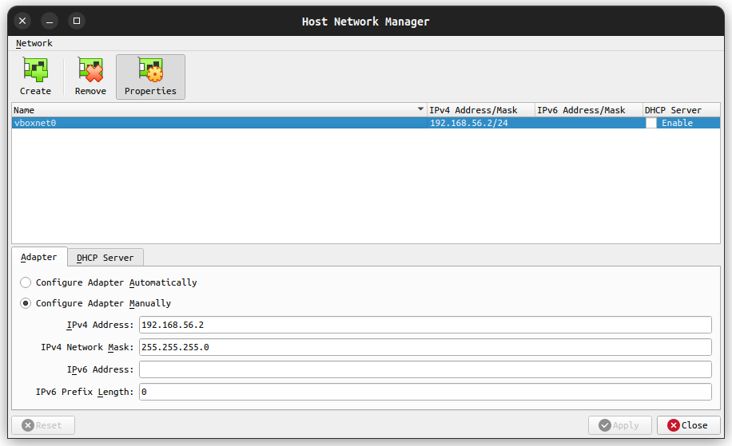

# Server configuration for MySQL service

In this repository I'll explain how to configure a VM Ubuntu server for deploying a MySQL service.

## System

For this server I chose [Ubuntu Server 22.04](https://ubuntu.com/download/server "Ubuntu Server 22.04 Jammy Jellyfish download page") as a server.

The system properties configured in VirtualBox are the following ones:

-  **CPU cores**: at least 2 (1 should be good but the more the merrier).
-  **RAM**: at least 2048 MB (2 GB), depending on your host machine RAM.
-  **HARD DRIVE**: 12 GB is perfectly fine (VirtualBox recommends 10 GB).

For the network interfaces, since my school's network design does not permit use the _Bridged Adapter_, I configured 2 interfaces:

-  One set to **_NAT_** (connection to outside network).
-  The other one set to **_Host-only Adapter_** to be able to connect the host device to the Virtual Machine.

To configure the secondary network interface is necessary to configure it. To do it, it's needed to access the _Host Network Manager_ by `Ctrl + H` keyboard key combination.

This configuration is recommended even though the network allows to use the _Bridged Adapter_, because the _Host-only Adapter_ will be configured in the system with a static IP so it will not care about if the network changes. For the connectivity interface could be set if wanted to.

## Server Installation

The process is pretty straight forward, just need to configure correctly the network interfaces' IP. Here is the process in screenshots.

-  Set the prefferred language:

-  Skip the installer update (may not appear if the `.iso` file is the latest):

-  Set the preferred keyboard layout:

-  Set installation type (just leave it as default):

-  Network configuration:

As you can see, set a static IP for the _Host-only Adapter_ (will be the one without IP, the _NAT_/_Bridged Adapter_ will have an IP assigned by DHCP).

-  Configure disk encryption (I just leave this as default always)

(I skipped the proxy and mirrors steps, just leave them as they are)

-  Storage configuration (configuration resume)

-  Set system name, username and password

(Again I skipped some steps before installation is executed, if you want to install OpenSSH server or other packages in the installation process you'll need to do some extra config here).

Once all these steps are done, **installation is executed and you'll only need to wait until it's completed**.
